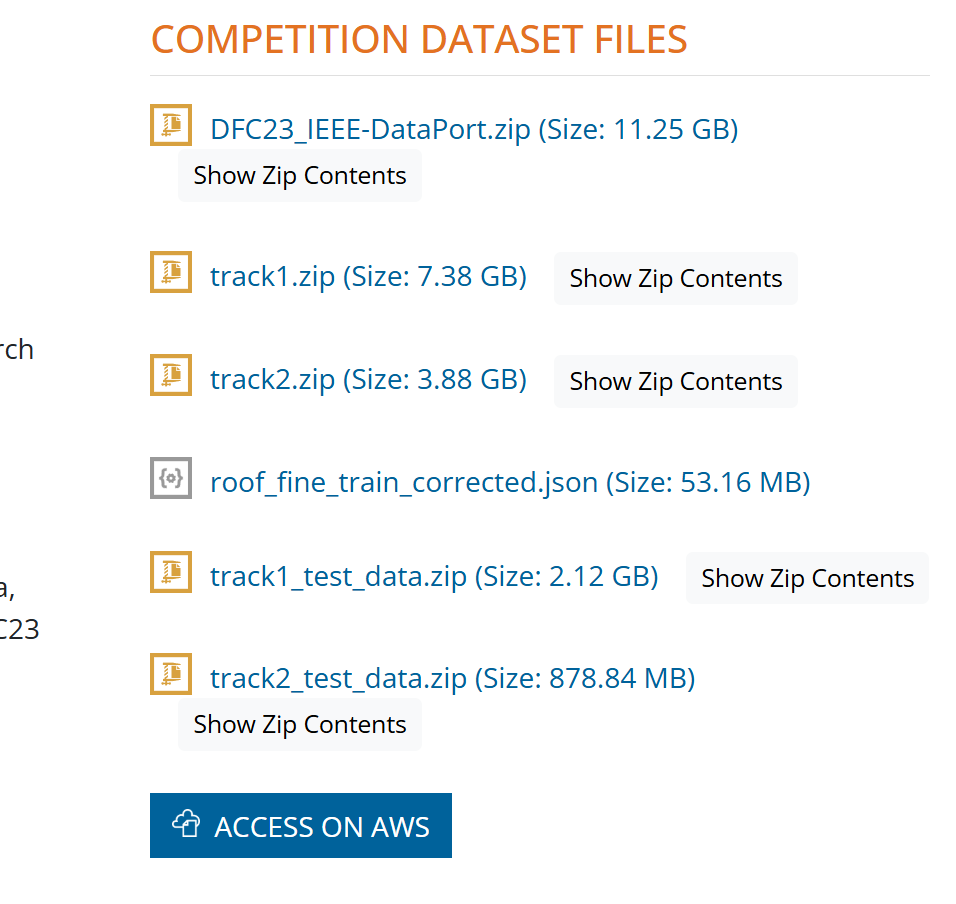
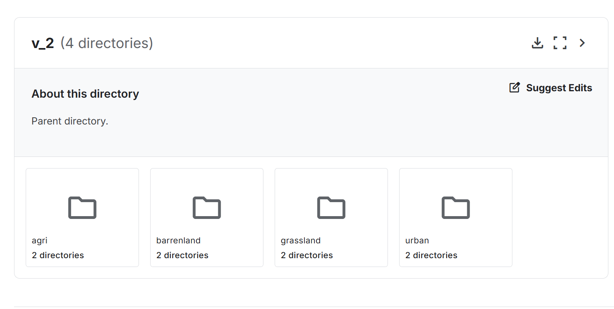

#  Cross-modal Ship Re-identification via Optical and SAR Imagery: A Novel Dataset and Method

### [**📝Paper**](https://arxiv.org/abs/2506.22027) | [**🗃️Dataset**](https://zenodo.org/records/15860212) | [**🤖Models**](https://huggingface.co/Alioth2000/TransOSS/tree/main)
The official repository for HOSS ReID Dataset and TransOSS.

## Abstract
>Detecting and tracking ground objects using earth observation imagery remains a significant challenge in the field of remote sensing.
Continuous maritime ship tracking is crucial for applications such as maritime search and rescue, law enforcement, and shipping analysis.
However, most current ship tracking methods rely on geostationary satellites or video satellites.
The former offer low resolution and are susceptible to weather conditions, while the latter have short filming durations and limited coverage areas, making them less suitable for the real-world requirements of ship tracking.
To address these limitations, we present the Hybrid Optical and Synthetic Aperture Radar (SAR) Ship Re-Identification Dataset (HOSS ReID dataset), designed to evaluate the effectiveness of ship tracking using low-Earth orbit constellations of optical and SAR sensors.
This approach ensures shorter re-imaging cycles and enables all-weather tracking.
HOSS ReID dataset includes images of the same ship captured over extended periods under diverse conditions, using different satellites of different modalities at varying times and angles.
Furthermore, we propose a baseline method for cross-modal ship re-identification, TransOSS, which is built on the Vision Transformer architecture.
It refines the patch embedding structure to better accommodate cross-modal tasks, incorporates additional embeddings to introduce more reference information, and employs contrastive learning to pre-train on large-scale optical-SAR image pairs, ensuring the model's ability to extract modality-invariant features.

## HOSS ReID Dataset
The HOSS ReID dataset and the associated pretraining dataset are publicly available on [zenodo](https://zenodo.org/records/15860212). 已下载
The pretraining dataset is constructed based on the [SEN1-2](https://www.kaggle.com/datasets/requiemonk/sentinel12-image-pairs-segregated-by-terrain) and [DFC23](https://ieee-dataport.org/competitions/2023-ieee-grss-data-fusion-contest-large-scale-fine-grained-building-classification) datasets. \
To run TransOSS, please organize the data in the following structure under the `data` directory:

```
data
├── HOSS
│   ├── bounding_box_test
│   ├── bounding_box_train
│   └── ...
└── OptiSar_Pair
    ├── 0001
    ├── 0002
    └── ...

```


## Pipeline


## Requirements

### Installation
The Python version we use is 3.9, and the PyTorch version is 2.2.2. It is recommended not to use versions lower than these.

```bash
pip install -r requirements.txt
```

## Training
### Pretraining
We utilize 4 GPUs for pretraining
```bash
CUDA_VISIBLE_DEVICES=0,1,2,3 python -m torch.distributed.launch --nproc_per_node=4 --master_port 6667 train_pair.py --config_file configs/pretrain_transoss.yml MODEL.DIST_TRAIN True
```
### Fine-tune
Single GPU fine-tuning
```bash
python train.py --config_file configs/hoss_transoss.yml
```
Multiple GPUs fine-tuning
```bash
CUDA_VISIBLE_DEVICES=0,1 python -m torch.distributed.launch --nproc_per_node=2 --master_port 6667 train.py --config_file configs/hoss_transoss.yml MODEL.DIST_TRAIN True
```
## Evaluation
```bash
python test.py --config_file configs/hoss_transoss.yml MODEL.DEVICE_ID "('0')"  TEST.WEIGHT 'weights/HOSS_TransOSS.pth'
```

## Citation
```
@InProceedings{Wang_2025_ICCV,
    author    = {Wang, Han and Li, Shengyang and Yang, Jian and Liu, Yuxuan and Lv, Yixuan and Zhou, Zhuang},
    title     = {Cross-modal Ship Re-Identification via Optical and SAR Imagery: A Novel Dataset and Method},
    booktitle = {Proceedings of the IEEE/CVF International Conference on Computer Vision (ICCV)},
    month     = {October},
    year      = {2025},
    pages     = {7873-7883}
}
```

## Acknowledgement
Codebase from [TransReID](https://github.com/damo-cv/TransReID/tree/main), [reid-strong-baseline](https://github.com/michuanhaohao/reid-strong-baseline) , [pytorch-image-models](https://github.com/rwightman/pytorch-image-models).


# 2023 IEEE GRSS Data Fusion Contest: Large-Scale Fine-Grained Building Classification for Semantic Urban Reconstruction

@data{mrnt-8w27-22,
doi = {10.21227/mrnt-8w27},
url = {https://dx.doi.org/10.21227/mrnt-8w27},
author = {Claudio Persello and Ronny Hänsch and Gemine Vivone and Kaiqiang Chen and Zhiyuan Yan and Deke Tang and Hai Huang and Michael Schmitt and Xian Sun},
publisher = {IEEE Dataport},
title = {2023 IEEE GRSS Data Fusion Contest: Large-Scale Fine-Grained Building Classification for Semantic Urban Reconstruction},
year = {2022} }



#### Abstract

Buildings are essential components of urban areas. While research on the extraction and 3D reconstruction of buildings is widely conducted, information on fine-grained roof types of buildings is usually ignored. This limits the potential of further analysis, e.g., in the context of urban planning applications. The fine-grained classification of building roof type from satellite images is a highly challenging task due to ambiguous visual features within the satellite imagery. The difficulty is further increased by the lack of corresponding fine-grained building classification datasets. The 2023 IEEE GRSS Data Fusion Contest, organized by the Image Analysis and Data Fusion Technical Committee (IADF TC) of the IEEE Geoscience and Remote Sensing Society (GRSS), the Aerospace Information Research Institute under the Chinese Academy of Sciences, the Universität der Bundeswehr München, and GEOVIS Earth Technology Co., Ltd. aims to push current research on building extraction, classification, and 3D reconstruction towards urban reconstruction with fine-grained semantic information of roof types.

To this aim, the DFC23 establishes a large-scale, fine-grained, and multi-modal benchmark for the classification of building roof types. It consists of two challenging competition tracks investigating the fusion of optical and SAR data, while focusing on roof type classification and building height estimation, respectively. The data provided by the DFC23 includes several novel properties:

**Globally Distributed Large-Scale Dataset.** A novel large-scale urban building classification and reconstruction dataset is provided. Buildings are distributed across seventeen cities in six continents to cover a wide range of different building styles. This allows capturing the heterogeneity of cities in different continents with various landforms. 

**Fine-Grained Roof Type Categories.**The buildings are labeled according to a detailed (fine-grained) categorization of roof types. The DFC23 provides nearly 300k instances with twelve different types of building roofs which renders building classification significantly more challenging.

**Multimodal Data.**To facilitate multimodal data fusion, not only optical imagery, but also Synthetic Aperture Radar (SAR) images are provided. The information captured by these different modalities can be jointly exploited, potentially resulting in the development of more accurate building extraction and classification models.

 

#### Instructions:

 

**Track 1: Building Detection and Roof Type Classification**

This track focuses on the detection and classification of building roof types from high-resolution optical satellite imagery and SAR images. The SAR and optical modalities are expected to provide complementary information. The given dataset covers seventeen cities worldwide across six continents. The classification task consists of twelve fine-grained, predefined roof types. 

 **Track 2: Multi-Task Learning of Joint Building Extraction and Height Estimation**

This track defines the joint task of building extraction and height estimation. Both are two very fundamental and essential tasks for building reconstruction. Same as in Track 1, the input data are multimodal optical and SAR satellite imagery. Building extraction and height estimation from single-view satellite imagery depend on semantic features extracted from the imagery. Multi-task learning provides a potentially superior solution by reusing features and forming implicit constraints between multiple tasks in comparison to conventional separate implementations. Satellite images are provided with reference data, i.e., building annotations and normalized Digital Surface Models (nDSMs). The participants are required to reconstruct building heights and extract building footprints. 

**Competition Phases**

The contest in both tracks will consist of two phases:

**Phase 1**: Participants are provided with training data and additional validation images (without corresponding reference data) to train and validate their algorithms. Participants can submit results for the validation set to the Codalab competition website to get feedback on the performance. The performance of the best submission from each account will be displayed on the leaderboard. In parallel, participants submit a short description of the approach used to be eligible to enter Phase 2. 

**Phase 2**: Participants receive the test data set (without the corresponding reference data) and submit their results within seven days from the release of the test data set. After evaluation of the results, three winners for each track are announced. Following this, they will have one month to write their manuscript that will be included in the IGARSS 2023 proceedings. Manuscripts are 4-page IEEE-style formatted. Each manuscript describes the addressed problem, the proposed method, and the experimental results. 

**Calendar**

·     January 3: Contest opening: release of training and validation data

·     January 4: Evaluation server begins accepting submissions for validation data set

·     February 28: Short description of the approach in 1-2 pages for each track is sent to iadf_chairs@grss-ieee.org (using the IGARSS paper template)

·     March 7: Release of test data; evaluation server begins accepting test submissions

·     March 13: Evaluation server stops accepting submissions

·     March 15: Updated and final description of the approach

·     March 28: Winner announcement

·     April 23: Internal deadline for papers, DFC Committee review process

·     May 22: Submission deadline of final papers to be published in the IGARSS 2023 proceedings

**The Data**

**Data Source**

Images of the DFC23 dataset are collected from the SuperView-1 (or “GaoJing” in Chinese), Gaofen-2 and Gaofen-3 satellites, with spatial resolutions of 0.5 m, 0.8 m, and 1m, respectively. Normalized Digital Surface Models (nDSMs) provided for reference in Track 2 are produced from stereo images captured by Gaofen-7 and WorldView 1 and 2 with a ground sampling distance (GSD) of roughly 2 m. Data was collected from seventeen cities on six continents to provide a large and representative data set of high diversity regarding landforms, architecture, and building types. 

**Category design**

There are twelve fine-grained roof type classes based on the geometry of the roof.

The data is partitioned into three partitions, which are training set, validation set and test set. The participants can access the training set (including the optical images, the corresponding SAR images, and the reference) and the validation set (without reference) in the development phase. In the test phase, the test set (without reference) will be released.

**Submission and Evaluation**

**Track 1**: Participants should submit results to the [Codalab competition website](https://codalab.lisn.upsaclay.fr/competitions/8987) to get feedback on the performance. The submitted format should follow the MS COCO format (in a JSON file), including segmentation results represented by polygons (i.e., a sequence of points to delineate the building contours) or [RLE](https://github.com/cocodataset/cocoapi/blob/master/PythonAPI/pycocotools/mask.py) (run-length encoding), one fine-grained category with a confidence for each instance and one optional bounding box.

For evaluation, we adopt the standard COCO metric AP50 (the IoU threshold is 0.5), where the loU is evaluated based on the masks converted from the ground truth masks and the submitted masks. The participants with the highest AP50 are declared as the winners. It is noted that AP50 is a very strict metric. Categories are taken into consideration when computing the IoU score.

**Track 2**: Participants should submit results to the [Codalab competition website](https://codalab.lisn.upsaclay.fr/competitions/8988) to get feedback on the performance. The submitted results should include two parts. The first part is a building extraction result, which is the same as the previous track with the only exception that the category is not taken into consideration in this track. The second part is a pixel-wise height estimation result, which is a map of the same resolution as the input. The second part should be a *tif* file with the same name as the corresponding optical image.

For evaluation, the metric of the building extraction is the same as Track 1 (categories are not taken into consideration) and the metric of height estimation is threshold accuracy (see the DFC23 page for details).

**Baseline**

A baseline that shows how to use the DFC23 data to train models, make submissions, etc., can be found [here](https://github.com/AICyberTeam/DFC2023-baseline).

**Results, Awards, and Prizes**

- The first to fourth-ranked teams in each track will be declared winners.
- The authors of the winning submissions will:
  - Present their approach in an invited session dedicated to the DFC23 at IGARSS 2023
  - Publish their manuscripts in the proceedings of IGARSS 2023
  - Be awarded IEEE Certificates of Recognition
- The first, second, and third-ranked teams of each track will receive $5,000, $2,000, and $1,000 (USD), respectively, as a cash prize.
- The authors of the first and second-ranked teams of each track will co-author a journal paper which will summarize the outcome of the DFC23 and will be submitted with open access to IEEE JSTARS.
- Top-ranked teams will be awarded during IGARSS 2023, Pasadena, USA in July 2023. The costs for open-access publication in JSTARS will be supported by the GRSS. The winner team prize is kindly sponsored by the organizing partners.

 **The Rules of the Game**

 ·     The dataset can be openly downloaded

 ·     Validation and test data can be requested by registering for the Contest at IEEE DataPort.

 ·     To enter the contest, participants must read and accept the Contest Terms and Conditions.

 ·     Participants of the contest are intended to submit results as the *Submission and Evaluation Section* required.

 ·     The results will be submitted to the Codalab competition website for evaluation. 

 ·     Ranking between the participants will be based on the metrics as described in the *Submission and Evaluation Section*.

 ·     The maximum number of trials of one team is five per day in the test phase.

 ·     The submission server of the test phase will be opened from March 7, 2023. The deadline for result submission and final description is March 13, 2023, 23:59 UTC–12 hours (e.g., March 13, 2023, 7:59 in New York City, 13:59 in Paris, or 19:59 in Beijing). 

 ·     Each team needs to submit a short paper of 1–2 pages clarifying the used approach, the team members, their Codalab accounts, and one Codalab account to be used for the test phase by Feburary 28, 2023. Please send a paper to iadf_chairs@grss-ieee.org using the IGARSS paper template.

 ·     For the winning teams, the internal deadline for full paper submission is April 23, 2023, 23:59 UTC – 12 hours (e.g., April 23, 2023, 7:59 in New York City, 13:59 in Paris, or 19:59 in Beijing). 

 ·     Important: Only team members explicitly stated on these documents will be considered for the next steps of the DFC, i.e., being eligible to be awarded as winners and joining the author list of the respective potential publications (IGARSS23 and JSTARS articles). Furthermore, no overlap among teams is allowed, i.e., one person can only be a member of one team. Adding more team members after the end of the development phase, i.e., after submitting these documents is not possible.

 ·     Persons directly involved in the organization of the contest, i.e., the (co-)chairs of IADF as well as the co-organizers are not allowed to enter the contest. Please note that IADF WG leads can enter the contest. They have been actively excluded from all information concerning the content of the DFC to ensure a fair competition.

Failure to follow any of these rules will automatically make the submission invalid, resulting in the manuscript not being evaluated and disqualification from the prize award.

Participants in the Contest are requested not to submit an extended abstract describing their approach to tackle the DFC23 to IGARSS 2023 by the corresponding conference deadline in January 2023. Only contest winners (participants corresponding to the best-ranking submissions) will submit a 4-page paper describing their approach to the Contest by April 23, 2023. The received manuscripts will be reviewed by the Award Committee of the Contest, and reviews will be sent to the winners. Winners will submit the 4-pages full-paper to the Award Committee of the Contest by May 22, who will then take care of the submission to the IGARSS Data Fusion Contest Community Contributed Session by May 31, 2023, for inclusion in the IGARSS Technical Program and Proceedings.

**Terms and Conditions**

Participants of this challenge acknowledge that they have read and agree to the following Contest Terms and Conditions:

- In any scientific publication using the data, the data shall be referenced as follows: “[REF. NO.] 2023 IEEE GRSS Data Fusion Contest. Online: [www.grss-ieee.org/technical-committees/image-analysis-and-data-fusion/](http://www.grss-ieee.org/technical-committees/image-analysis-and-data-fusion/)”.
- Any scientific publication using the data shall include a section “Acknowledgement”. This section shall include the following sentence: “The authors would like to thank the IEEE GRSS Image Analysis and Data Fusion Technical Committee, Aerospace Information Research Institute, Chinese Academy of Sciences, Universität der Bundeswehr München, and GEOVIS Earth Technology Co., Ltd. for organizing the Data Fusion Contest”.
- Any scientific publication using the data shall refer to the following paper:
  ·    [Huang et al., 2022] Huang, X., Ren, L., Liu, C., Wang, Y., Yu, H., Schmitt, M., Hänsch, R., Sun, X., Huang, H., Mayer, H., 2022. Urban Building Classification (UBC) – A Dataset for Individual Building Detection and Classification from Satellite Imagery. In: Proceedings of the IEEE/CVF Conference on Computer Vision and Pattern Recognition. pp. 1413-1421.

**Acknowledgements**

The IADF TC chairs would like to thank the Aerospace Information Research Institute under the Chinese Academy of Sciences, the Universität der Bundeswehr München, and GEOVIS Earth Technology Co., Ltd. for providing the data and the IEEE GRSS for continuously supporting the annual Data Fusion Contest through funding and resources.

The winners of the competition will receive a total of $16k as prizes, courtesy of [GEOVIS Earth Technology Co., Ltd.


# Sentinel-1&2 Image Pairs (SAR & Optical)




## About Dataset

Dataset consists of SAR and Optical (RGB) image pairs from Sentinel‑1 and Sentinel‑2 satellites, provided by the Technical University of Munich.
[Sentinel-1&2 Image Pairs, Michael Schmitt, Technical University of Munich (TUM)](https://mediatum.ub.tum.de/1436631)

We searched through images captured during the fall season in the original dataset provided by TUM, and selected images which could belong to each of the four classes: *barren land*, *grassland*, *agricultural land*, and *urban areas*. Optical images shown in the following sections give an idea of the type of images belonging to each class. We have tried to introduced as much variation as possible when selecting images for a class.

Data can be used to train a Conditional GAN. Since the images in this dataset are highly complex i.e. they are not regularized and they do not have a neat geometric pattern or orientation, it can also be used to check the robustness of a model, no matter the task.